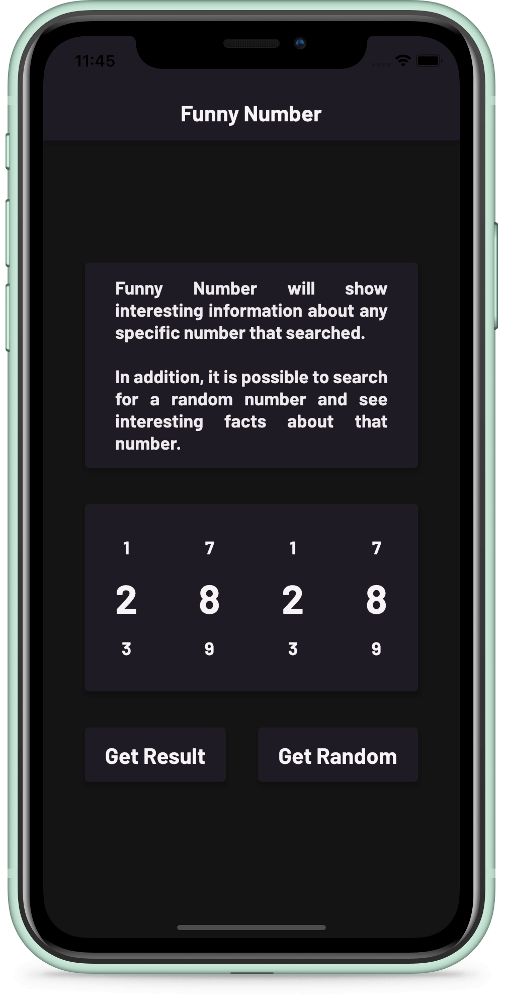
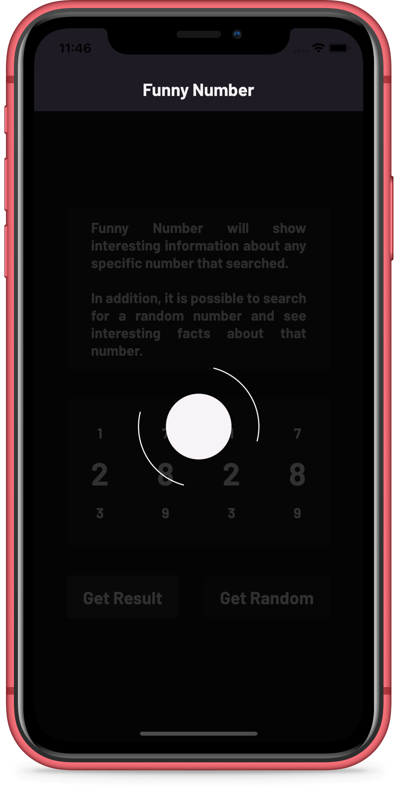
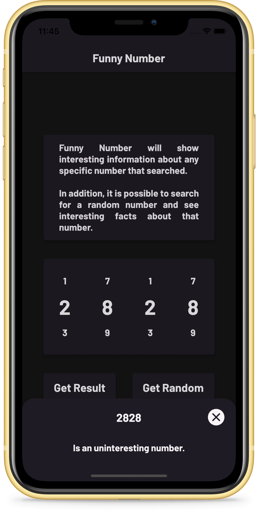
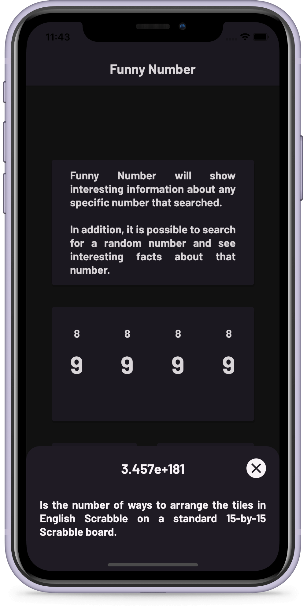

# 
Funny Number
 

An app that shows interesting information about any specific number that searched. In addition, it is possible to search for a random number and see interesting facts about that number.

Funny Number follows the Model View Controller (MVC) design pattern and uses the GetX package for state management. The project has been written solely in Dart Language.

&nbsp; 
&nbsp;

Screenshots of the app:

&nbsp;

&nbsp; &nbsp; &nbsp; &nbsp; &nbsp;

&nbsp;

&nbsp; &nbsp; &nbsp; &nbsp; &nbsp;
